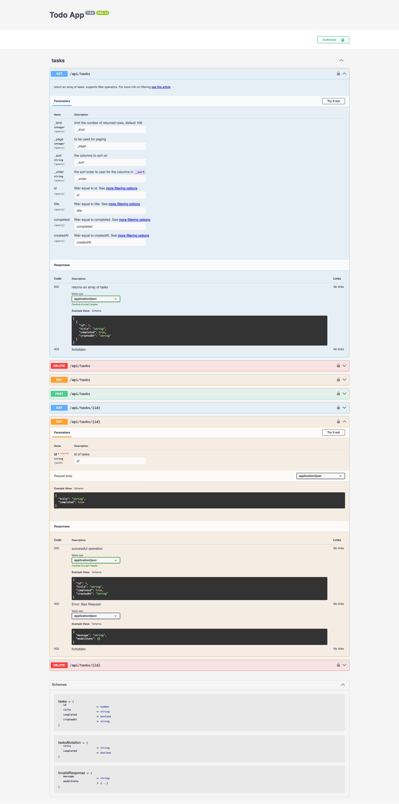

# Adding Swagger and openApi

In short, swagger provides a quick UI that describes the api which is exposed by the application.

To add swagger to a `remult` application follow these steps:

1. Install the `swagger-ui-express` package:

   ```sh
   npm i swagger-ui-express
   npm i --save-dev @types/swagger-ui-express
   ```

2. In the `/src/server/index.ts` file add the following code:

   ```ts{2,6-9}
   import express from 'express';
   import swaggerUi from 'swagger-ui-express';
   import { remultExpress } from 'remult/remult-express';

   const app = express();
   let api = remultExpress();

   app.use(api);
   const openApiDocument = api.openApiDoc({ title: "remult-react-todo" });
   app.get("/api/openApi.json", (req, res) => res.json(openApiDocument));
   app.use('/api/docs', swaggerUi.serve, swaggerUi.setup(openApiDocument));

   app.listen(3002, () => console.log("Server started"));
   ```


## Adding Swagger UI to a NextJs App

To add swagger UI to a `NextJs` application follow these steps:

1. Install the following packages:

   ```sh
   # With npm
   npm i swagger-ui-react
   npm i -D @types/swagger-ui-react

   # With yarn
   yarn add swagger-ui-react
   yarn add -D @types/swagger-ui-react
   ```

2. Get the openApi document from RemultNextAppServer:

   ```ts
   // src/api.ts
   import { Task } from "@/shared/Task";
   import { TasksController } from "@/shared/TasksController";
   import { remultNextApp } from "remult/remult-next";

   export const api = remultNextApp({
      admin: true,
      entities: [Task],
      controllers: [TasksController],
   });

   // Export this here 👇
   export const openApiDoc = api.openApiDoc({
      title: "Todo App",
   });

   export const { POST, PUT, DELETE, GET } = api;

   ```

3. Create a new page to render Swagger UI:

   ```tsx
   // src/app/api-doc/page.tsx
   import { openApiDoc } from "@/api"; // 👈 Import the openApiDoc you exported earlier
   import ReactSwagger from "./react-swagger";

   export default async function IndexPage() {
      return (
         <section className="container">
            <ReactSwagger spec={openApiDoc} />
         </section>
      );
   }
   ```

   ```tsx
   // src/app/api-doc/react-swagger.tsx
   "use client";

   import SwaggerUI from "swagger-ui-react";
   import "swagger-ui-react/swagger-ui.css";

   type Props = {
      spec: Record<string, any>;
   };

   function ReactSwagger({ spec }: Props) {
      return <SwaggerUI spec={spec} />;
   }

   export default ReactSwagger;
   ```

4. Navigate to `http://localhost:3000/api-doc` to see the Swagger UI.

   
